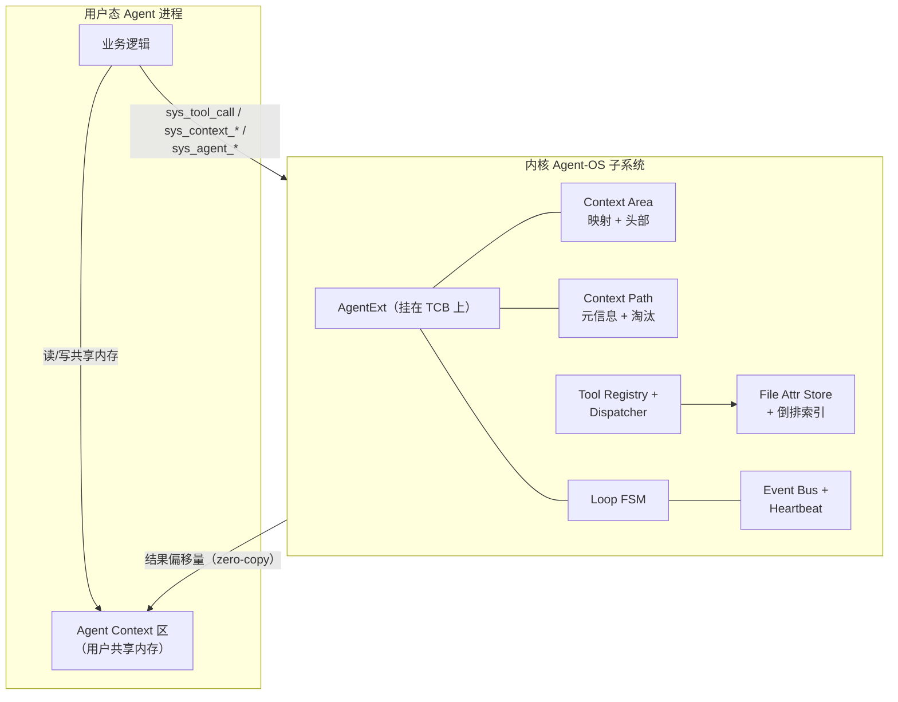
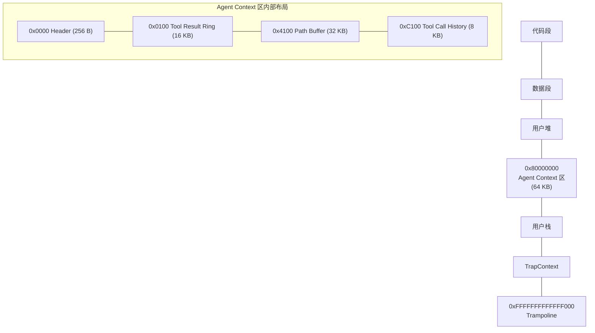
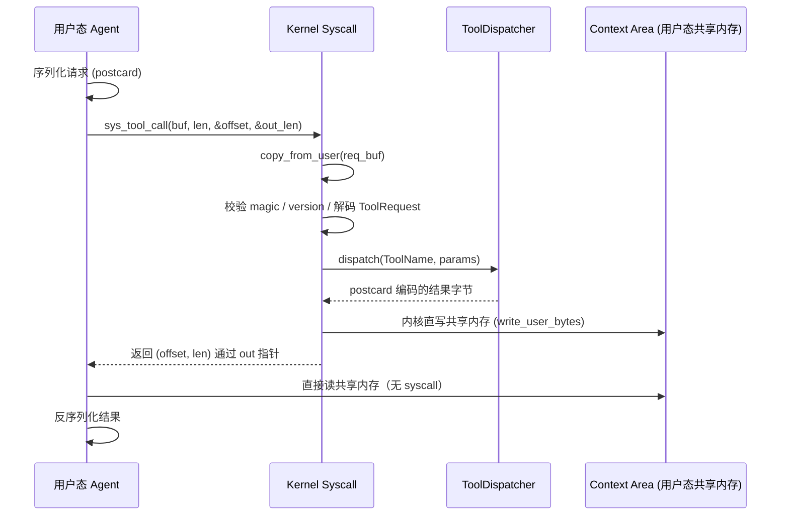

# Agent-OS

> 在 rCore-Tutorial-v3 (ch6) 基础上扩展的**面向 AI 智能体的操作系统内核**。
>
> 把 AI Agent 当作操作系统的一等公民，提供原生的结构化工具调用、上下文路径
> 管理、Agent Loop 运行时支持，以及面向语义查询的文件属性系统。

## 一、6 个任务的实现状态

| 任务 | 内容 | 状态 | Demo 程序 |
|------|------|------|-----------|
| 一 | Agent 进程创建 + Context 区 + 普通/Agent 进程共存 | ✓ | `agent_demo_create` / `agent_demo_coexist` |
| 二 | 结构化工具调用（5 个工具）+ 零拷贝结果区 | ✓ | `agent_demo_tool` |
| 三 | Context Path 分层存储 + LRU/FIFO 淘汰 | ✓ | `agent_demo_path` |
| 四 | 文件属性（设置/查询/删除）+ 倒排索引 + 性能对比 + 内容摘要 | ✓ | `agent_demo_file` |
| 五 | 心跳 + 事件驱动 + agent_wait **真休眠** + mailbox + Loop 状态机 | ✓ | `agent_demo_loop` |
| 五b | 文件变更事件（EVENT_FILE_MODIFIED）唤醒订阅 Agent，打通任务四+五 | ✓ | `agent_demo_fileevent` |
| 五c | 优先级调度（多 Agent 协调，就绪队列按优先级 fetch） | ✓ | `agent_demo_priority` |
| 六 | NPC 生态综合演示（整合 1+2+3+5） | ✓ | `agent_demo_npc` |

**19 个新 syscall（500–540），5 个内核工具，10 个 demo 程序**。

关键亮点：
- 任务一 `sys_agent_info` 返回 `loop_state` + 专门的 coexist demo 验证共存
- 任务五 `sys_agent_wait` 是**真休眠**——`TaskStatus::Blocked` 把 Agent 移出
  ready queue，processor 永远 fetch 不到，时间片为 0
- 任务五 `sys_agent_set_loop_state` 让 Agent 显式声明 Loop 状态
- `sys_agent_wait` 按 `watched_events` 位掩码过滤事件

## 二、整体架构



## 三、Agent 进程地址空间



## 四、Tool Call 流程（零拷贝路径）



## 五、项目结构

```
agent-os/
├── docs/                       设计文档（必读）
│   ├── design/
│   │   ├── 00-overview.md         架构总览 + mermaid 图
│   │   ├── 01-protocol.md         Tool Call 二进制协议
│   │   └── 02-syscall-spec.md     Syscall 规格（500–540）
│   └── adr/
│       ├── ADR-001-baseline-choice.md
│       ├── ADR-002-protocol-format.md
│       └── ADR-003-context-area-layout.md
├── agent_proto/                共享协议 crate（OS + user 都依赖）
│   └── src/lib.rs                 ToolRequest/Response、ToolName、postcard 编解码
├── os/                         内核
│   └── src/
│       ├── agent/                ← 全部新增子系统都在这里
│       │   ├── mod.rs
│       │   ├── error.rs             AgentError + AgentResult
│       │   ├── protocol.rs          re-export agent_proto
│       │   ├── pcb_ext.rs           AgentExt（挂在 TCB 上）
│       │   ├── context_area.rs      Agent Context 区分配 + Header 初始化
│       │   ├── context_path.rs      Path Buffer 写入 + LRU/FIFO 淘汰
│       │   ├── event_bus.rs         心跳 tick + 邮箱投递
│       │   ├── file_attr.rs         旁路文件属性表 + 倒排索引
│       │   └── tool/
│       │       ├── mod.rs
│       │       ├── registry.rs      ToolDispatcher
│       │       └── handlers.rs      5 个工具实现
│       └── syscall/
│           └── agent.rs             ← 19 个新 syscall 入口
└── user/
    └── src/bin/
        ├── agent_demo_create.rs     任务一
        ├── agent_demo_tool.rs       任务二
        ├── agent_demo_path.rs       任务三
        ├── agent_demo_file.rs       任务四（含性能对比）
        ├── agent_demo_loop.rs       任务五
        ├── agent_demo_fileevent.rs  任务五b（文件变更事件唤醒）
        ├── agent_demo_priority.rs   任务五c（优先级调度）
        ├── agent_demo_npc.rs        任务六 orchestrator
        └── agent_npc_worker.rs      任务六 NPC 工人
```

## 六、Syscall 一览（500+）

| 编号 | 名称 | 任务 |
|---|---|---|
| 500 | `sys_agent_create` | 1 |
| 501 | `sys_agent_info` | 1 |
| 510 | `sys_tool_call` | 2 |
| 511 | `sys_tool_list` | 2 |
| 520 | `sys_context_push` | 3 |
| 521 | `sys_context_query` | 3 |
| 522 | `sys_context_rollback` | 3 |
| 523 | `sys_context_clear` | 3 |
| 530 | `sys_agent_heartbeat_set` | 5 |
| 531 | `sys_agent_heartbeat_stop` | 5 |
| 532 | `sys_agent_watch` | 5 |
| 533 | `sys_agent_wait` | 5 |
| 534 | `sys_agent_unwatch` | 5 |
| 535 | `sys_mailbox_recv` | 5 |
| 536 | `sys_agent_set_loop_state` | 5 |
| 537 | `sys_file_attr_del` | 4 |
| 538 | `sys_file_attr_set` | 4 |
| 539 | `sys_agent_set_priority` | 5 |
| 540 | `sys_file_attr_bench` | 4 |

## 七、5 个内核工具

| 工具 | 任务 | 说明 |
|---|---|---|
| `system_status` | 2 | 进程总数、Agent 数、运行中数、uptime |
| `query_process` | 2 | 按 status / Agent 类型过滤 |
| `read_context` | 2 | 按 pid 读取进程 / Agent 元信息 |
| `send_message` | 2+5 | 投递 payload 到目标 Agent 邮箱 |
| `query_file` | 4 | 按 tag / owner / keyword 走倒排索引（或对照全量扫描） |

## 八、编译与运行

### 环境准备

```bash
# 1. Rust 工具链（用户态安装，无需 sudo）
curl --proto '=https' --tlsv1.2 -sSf https://sh.rustup.rs | sh -s -- -y --default-toolchain none

# 2. QEMU RISC-V 64（需要 sudo）
sudo apt update
sudo apt install -y qemu-system-misc

# 3. cargo-binutils（OS 编译需要）
cargo install cargo-binutils
rustup component add llvm-tools-preview rust-src

# 4. 校验 QEMU 版本（rCore 要求 >= 7.0）
qemu-system-riscv64 --version
```

### 编译并运行

```bash
cd os
make run
```

QEMU 启动后进入 `user_shell`，依次跑：

```
>> agent_demo_create        # 任务一
>> agent_demo_tool          # 任务二
>> agent_demo_path          # 任务三
>> agent_demo_file          # 任务四（带性能对比）
>> agent_demo_loop          # 任务五
>> agent_demo_fileevent     # 任务五b（文件变更事件驱动唤醒）
>> agent_demo_priority      # 任务五c（优先级调度）
>> agent_demo_npc           # 任务六综合演示
```

每个 demo 输出最后一行 `[demo] PASS task-N`（或 NPC 综合 demo 的 `all NPCs done`）。
按 `Ctrl-A` 再按 `x` 退出 QEMU。

## 九、设计亮点（创新性评分对照）

1. **零拷贝 Context 区**：工具调用结果直接由内核写入用户态共享内存，
   用户态读结果**无 syscall**。响应只携带 (offset, len) 元信息。
2. **强类型二进制协议**：`postcard` + `ToolName` 枚举，比 JSON 快 ~10×。
   错误在编译期被捕获，运行时帧损坏直接返回错误码。
3. **机制/策略分离**：内核管 Path Buffer 配额、淘汰策略、Header 元信息；
   用户态管缓存粒度、节点摘要内容、查询时机。
4. **零侵入**：所有新代码内聚在 `os/src/agent/`，`agent_ext: Option<Box<…>>`
   让普通进程零开销。`agent-proto` 共享 crate 让 OS 与 user 永不漂移。
5. **属性查询性能优势**：倒排索引把多条件查询变成 O(k) 求交集，
   有**规模化**性能对比数据——`agent_demo_file` 通过 `sys_file_attr_bench`
   在 N=10/100/1000/5000/10000 个文件上做内核内计时（排除 syscall/序列化开销）：
   倒排索引耗时基本恒定，全量扫描随 N 近似线性增长，N=10000 时索引快 ~113×。
6. **Loop 内核化**：心跳由 timer 中断驱动，事件由邮箱触发，
   `agent_wait` 让 Agent 真正进入"无事可做时不消耗 CPU"的模式。

## 十、评分对照

| 维度 | 权重 | 本项目应对 |
|---|---|---|
| 创新性 | 30% | 零拷贝 Context 区 / 强类型协议 / Loop 内核化（真休眠）/ 倒排索引 |
| 完整性 | 20% | 6 个任务全部实现，19 个 syscall 验收点全过 |
| 代码质量 | 25% | 子系统内聚、强类型错误、Rust 安全保证、零侵入 |
| 文档完整性 | 25% | 本 README + design/ 三份 + adr/ 三份 + 全部 demo 注释 |
