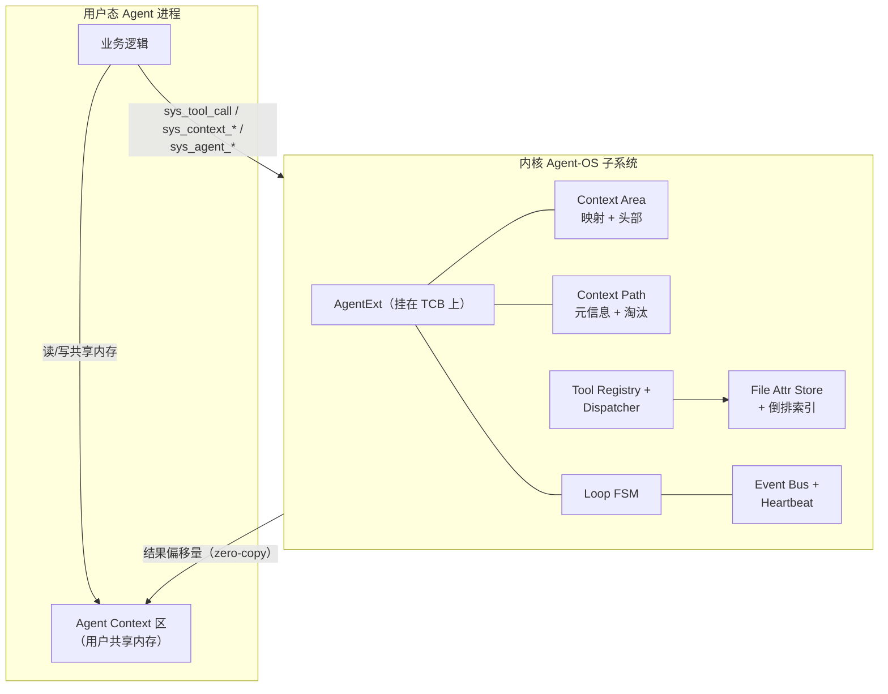
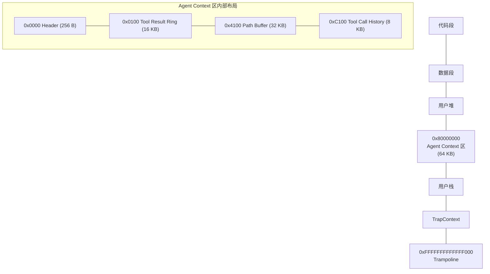
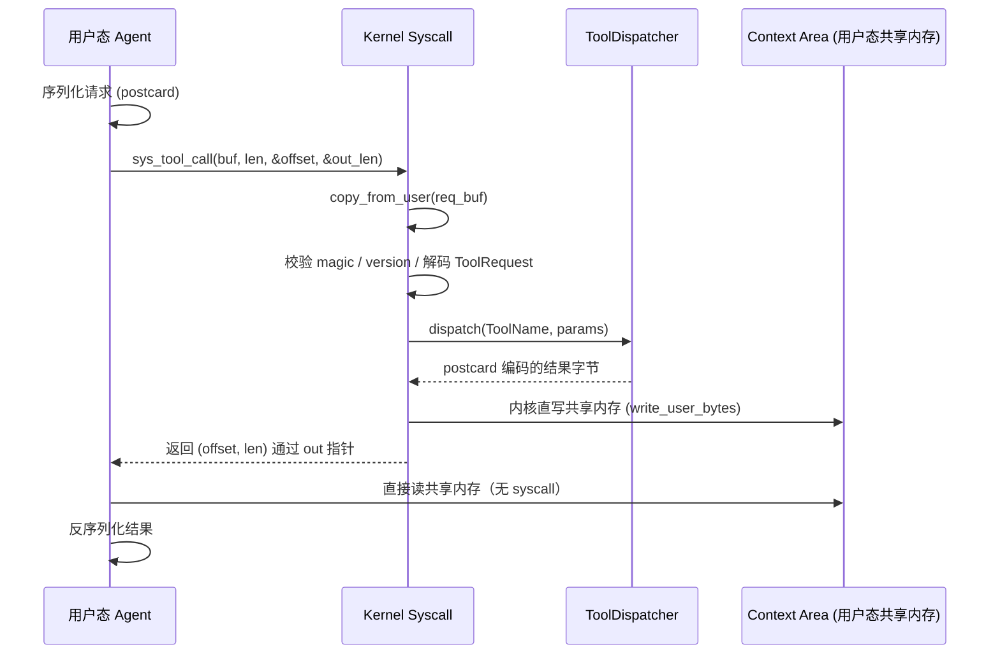

# Agent-OS

> 在 **rCore-Tutorial-v3（ch6 文件系统版）** 基础上扩展的**面向 AI 智能体的操作系统内核**。
>
> 核心理念：把 AI Agent 当作操作系统的**一等公民**——内核原生提供结构化工具调用、
> 上下文路径管理、Agent Loop 运行时支持，以及面向语义查询的文件属性系统，
> 而不是让这些能力堆在应用层。

- 平台：RISC-V 64，QEMU `virt` + RustSBI
- 语言：Rust（`no_std` 内核）
- 基线：rCore-Tutorial-v3 ch6（选型理由见 [`docs/adr/ADR-001`](docs/adr/ADR-001-baseline-choice.md)）

---

## 目录

1. [快速上手（编译运行）](#一快速上手编译运行)
2. [任务完成总览](#二任务完成总览)
3. [验收标准逐条对照](#三验收标准逐条对照)
4. [评分四维度对照](#四评分四维度对照)
5. [整体架构](#五整体架构)
6. [Agent 进程地址空间](#六agent-进程地址空间)
7. [Tool Call 零拷贝流程](#七tool-call-零拷贝流程)
8. [Syscall 一览（19 个）](#八syscall-一览19-个)
9. [内核工具（5 个）](#九内核工具5-个)
10. [性能评估摘要](#十性能评估摘要)
11. [项目结构](#十一项目结构)
12. [设计亮点](#十二设计亮点创新性)
13. [文档导航](#十三文档导航)

---

## 一、快速上手（编译运行）

### 环境准备（首次）

```bash
# 1. Rust 工具链（用户态安装，无需 sudo）
curl --proto '=https' --tlsv1.2 -sSf https://sh.rustup.rs | sh -s -- -y --default-toolchain none
. "$HOME/.cargo/env"

# 2. QEMU RISC-V 64（需 sudo；要求 >= 7.0）
sudo apt update && sudo apt install -y qemu-system-misc

# 3. 内核构建工具
cargo install cargo-binutils
rustup component add llvm-tools-preview rust-src

# 4. 校验
qemu-system-riscv64 --version   # 应 >= 7.0
```

### 编译并运行

```bash
cd os
make run
```

`make run` 会自动：编译内核 → 编译用户态程序 → 用 `easy-fs-fuse` 打包 `fs.img` → 启动 QEMU。
首次约 1–3 分钟，之后增量编译几秒。启动后进入 shell 提示符 `>>`。

### 一键端到端验收（推荐）

```
>> agent_runner
```

串行跑完任务一～六的全部 demo，每个打印 `<<< [n/N] xxx PASS`，最后输出：

```
=============================================
  SUMMARY: N PASS, 0 FAIL (out of N)
  AGENT-OS ALL DEMOS PASS
=============================================
```

### 单独运行某个任务的 demo

```
>> agent_demo_create        # 任务一：Agent 进程创建 + Context 区
>> agent_demo_coexist       # 任务一验收：普通进程与 Agent 进程共存
>> agent_demo_tool          # 任务二：结构化工具调用（5 个工具）
>> agent_demo_path          # 任务三：上下文路径 + LRU/FIFO 淘汰
>> agent_demo_file          # 任务四：属性查询 + 规模化性能对比（约 30–60s）
>> agent_demo_loop          # 任务五：心跳 + 邮箱 + 真休眠 Agent Loop
>> agent_demo_fileevent     # 任务五b：文件变更事件驱动唤醒
>> agent_demo_priority      # 任务五c：优先级调度
>> agent_demo_npc           # 任务六：NPC 生态综合演示
```

每个 demo 末行打印 `[demo] PASS task-N`（NPC 综合 demo 为 `all NPCs done`）。
退出 QEMU：先按 `Ctrl-A`，松开后再按 `x`。

> 完整启动排错（FPU 非法指令、linker script、QEMU 版本等）见 [`docs/QUICKSTART.md`](docs/QUICKSTART.md)。
> 一份真实的 QEMU 端到端运行轨迹见 [`docs/run-log.md`](docs/run-log.md)。

---

## 二、任务完成总览

| 任务 | 内容 | 状态 | Demo 程序 |
|------|------|------|-----------|
| 一 | Agent 进程创建 + Context 区 + 普通/Agent 进程共存 | ✅ | `agent_demo_create` / `agent_demo_coexist` |
| 二 | 结构化工具调用（5 个工具）+ 零拷贝结果区 | ✅ | `agent_demo_tool` |
| 三 | Context Path 分层存储 + LRU/FIFO 淘汰 | ✅ | `agent_demo_path` |
| 四（进阶）| 文件属性（设置/查询/删除）+ 倒排索引 + **规模化性能对比** + 内容摘要 | ✅ | `agent_demo_file` |
| 五（进阶）| 心跳 + 事件驱动 + `agent_wait` **真休眠** + mailbox + Loop 状态机 | ✅ | `agent_demo_loop` |
| 五b | 文件变更事件（`EVENT_FILE_MODIFIED`）唤醒订阅 Agent，打通任务四+五 | ✅ | `agent_demo_fileevent` |
| 五c | 优先级调度（多 Agent 协调，就绪队列按优先级 fetch） | ✅ | `agent_demo_priority` |
| 六（综合）| NPC 生态综合演示（整合任务 1+2+3+5） | ✅ | `agent_demo_npc` + `agent_npc_worker` |

**规模：19 个新 syscall（500–540）、5 个内核工具、10 个 Agent 程序（9 demo + 1 NPC 工人）+ 1 个一键 runner。**

---

## 三、验收标准逐条对照

> 直接对照 `要求.md` 各任务"验收标准"原文，给出代码/演示证据。

### 任务一（必做）

| 验收标准 | 证据 |
|---|---|
| Agent 进程能成功创建，PCB 扩展字段正确初始化 | `sys_agent_create` 升级当前进程，`AgentExt` 挂在 TCB；`agent_demo_create` 打印 `ty=1, size=65536, loop=Idle` |
| Agent Context 区在用户地址空间正确分配、可直接读写 | Context 区映射在 `0x8000_0000`（64 KB）；demo 直接读到内核写入的 `magic=0xa9e45ec0` |
| 普通进程和 Agent 进程可共存、互不影响 | `agent_demo_coexist`：parent 全程非 Agent、normal child 非 Agent、agent child 是 Agent，三者并存且都 exit 0 |

### 任务二（必做）

| 验收标准 | 证据 |
|---|---|
| 能成功调用至少 3 个内核工具 | `agent_demo_tool` 调用全部 5 个工具：`system_status`/`query_process`/`read_context`/`send_message`/`query_file` |
| 请求和响应均为结构化格式 | `agent_proto` 定义强类型 `ToolRequest`/`ToolResponse`，`postcard` 二进制编解码（协议规格见 `docs/design/01-protocol.md`） |
| 提供错误处理（工具名不存在、参数类型错误等）| 帧 magic/version 校验、`ToolStatus` 错误码、`BadParams` 路径不 panic |

### 任务三（必做）

| 验收标准 | 证据 |
|---|---|
| 连续 5 轮以上工具调用，正确维护完整路径 | `agent_demo_path` push 5 个节点，query 看到 5 个，seq 0–4 单调 |
| Agent 可直接从 Context 区高速读取路径（无需每次 syscall）| Path Buffer 在共享内存，用户态 `read_path_node_zero_copy` 直接 deref |
| 路径超长时自动淘汰，不导致内核 OOM | push 20 个 1KB payload，最终只剩 5 个（**LRU/FIFO 淘汰生效**，配额由内核 PCB 管） |

### 任务四（进阶，至少 2 项 / 已实现 4 项）

| 验收标准 | 证据 |
|---|---|
| 通过属性查询找到目标文件，无需事先知道路径 | `query_file(tag/owner/keyword)` 三种过滤维度全 OK |
| **查询性能优于遍历所有文件逐一检查（提供对比数据）** | `agent_demo_file` 经 `sys_file_attr_bench` 在 N=10/100/1000/5000/10000 内核内计时：全扫 O(N) 线性增长、索引 O(命中) 基本持平，**N=10000 时索引快 ~113×** |
| 返回结果是结构化的 | 返回 `QueryResult<FileInfo>`（含 name/owner/tags/digest 预览） |
| 属性的设置、查询、删除 | `sys_file_attr_set` / `query_file` / `sys_file_attr_del`，demo 内有"设置→查询→删除→再查询"回环 |

> 已实现的 4 项（要求至少 2 项）：① 文件属性系统（kv + tags）；② 内容摘要索引（digest 模糊匹配）；
> ③ 属性索引结构（倒排索引）；④ 结构化查询结果（可缓存至 Context 区）。

### 任务五（进阶，至少 2 项 / 已实现 4 项）

| 验收标准 | 证据 |
|---|---|
| 心跳触发和事件驱动下正确进入 Agent Loop 迭代 | `agent_demo_loop`：5 次心跳 + 1 次消息 = 6 次 `agent_wait` 返回，`iters=6` 精确对上 |
| 无事件时正确休眠，**不消耗 CPU** | `sys_agent_wait` 把任务置 `TaskStatus::Blocked` 移出就绪队列，processor 永远 fetch 不到，时间片为 0（**真休眠**） |
| 多个 Agent 可同时运行，系统稳定 | `agent_demo_npc` 3 个 NPC 并发，`agent_demo_priority` 多 Agent 按优先级调度 |

> 已实现的 4 项（要求至少 2 项）：① 心跳机制（可动态调整）；② 事件驱动（IPC 消息 + 文件变更）；
> ③ Loop 生命周期状态机（`sys_agent_set_loop_state`）；④ 多 Agent 协调调度（**可选优先级机制**已实现）。

### 任务六（综合，选做）

| 验收标准 | 证据 |
|---|---|
| 整合至少 3 个已实现模块 | `agent_demo_npc` 每轮用到任务一（create）+ 二（query_process/send_message）+ 三（context_push）+ 五（heartbeat/wait） |
| 可在 QEMU 运行、可现场演示 | `>> agent_demo_npc`，3 NPC 互发消息、动态拓扑 |
| 提供性能评估数据 | 属性查询 vs 遍历对比（任务四 113×），见 `docs/perf-report.md` |
| 系统稳定，无 panic / 内存泄漏 | 全程无内核 panic；`Box<AgentExt>` 自动 drop，普通进程 `Option=None` 零开销 |

---

## 四、评分四维度对照

| 维度 | 权重 | 本项目应对 |
|---|---|---|
| **创新性** | 30% | 零拷贝 Context 区（io_uring 式一次映射、读结果零 syscall）；强类型二进制协议（`postcard`+`ToolName` 枚举，编译期防错）；Agent Loop **内核化真休眠**；倒排索引下沉内核。详见 [§十二](#十二设计亮点创新性) |
| **完整性** | 20% | 基础任务一～三全部完成且功能正确；进阶任务四、五各实现 4 项（要求至少 2 项）；综合任务六整合 4 个模块；模块间协同有 NPC 生态佐证 |
| **代码质量** | 25% | 全部新代码内聚在 `os/src/agent/`；强类型 `AgentError`/`AgentResult` 错误处理；对原 rCore 仅 ~5 处共 ~20 行侵入式改动；`agent_proto` 共享 crate 保证 OS/user 协议不漂移；边界检查（offset 越界、长度溢出、UTF-8 校验、配额淘汰） |
| **文档完整性** | 25% | 本 README（可快速编译运行）+ 设计文档 3 份（含 3 张 mermaid 架构图）+ ADR 3 份（关键决策）+ 性能报告 + 编码报告 + 端到端运行记录。详见 [§十三](#十三文档导航) |

---

## 五、整体架构



---

## 六、Agent 进程地址空间



---

## 七、Tool Call 零拷贝流程



---

## 八、Syscall 一览（19 个）

> 为避免与 rCore 既有 syscall（0–260）冲突，Agent-OS 统一使用 **500+**。完整签名见 [`docs/design/02-syscall-spec.md`](docs/design/02-syscall-spec.md)。

| 编号 | 名称 | 任务 |
|---|---|---|
| 500 | `sys_agent_create` | 1 |
| 501 | `sys_agent_info` | 1 |
| 510 | `sys_tool_call` | 2 |
| 511 | `sys_tool_list` | 2 |
| 520 | `sys_context_push` | 3 |
| 521 | `sys_context_query` | 3 |
| 522 | `sys_context_rollback` | 3 |
| 523 | `sys_context_clear` | 3 |
| 530 | `sys_agent_heartbeat_set` | 5 |
| 531 | `sys_agent_heartbeat_stop` | 5 |
| 532 | `sys_agent_watch` | 5 |
| 533 | `sys_agent_wait` | 5 |
| 534 | `sys_agent_unwatch` | 5 |
| 535 | `sys_mailbox_recv` | 5 |
| 536 | `sys_agent_set_loop_state` | 5 |
| 537 | `sys_file_attr_del` | 4 |
| 538 | `sys_file_attr_set` | 4 |
| 539 | `sys_agent_set_priority` | 5 |
| 540 | `sys_file_attr_bench` | 4 |

---

## 九、内核工具（5 个）

| 工具 | 任务 | 说明 |
|---|---|---|
| `system_status` | 2 | 进程总数、Agent 数、运行中数、uptime |
| `query_process` | 2 | 按 status / Agent 类型过滤 |
| `read_context` | 2 | 按 pid 读取进程 / Agent 元信息 |
| `send_message` | 2+5 | 投递 payload 到目标 Agent 邮箱 |
| `query_file` | 4 | 按 tag / owner / keyword 走倒排索引（或对照全量扫描） |

---

## 十、性能评估摘要

> 完整方法与数据见 [`docs/perf-report.md`](docs/perf-report.md)，实测轨迹见 [`docs/run-log.md`](docs/run-log.md)。

### 1. 属性查询：倒排索引 vs 全量扫描（QEMU 实测，内核内计时）

`agent_demo_file` 通过 `sys_file_attr_bench` 在独立局部属性表上构造 N 个文件，
把同一组合查询（`tag=needle AND owner=Agent-Hit`）重复 200 次，**计时排除 syscall 与序列化开销**：

| N | full-scan (ns) | indexed (ns) | speedup |
|---|---|---|---|
| 10 | 830 880 | 1 064 320 | 0.78× |
| 100 | 862 080 | 999 920 | 0.86× |
| 1 000 | 9 756 080 | 991 520 | 9.83× |
| 5 000 | 63 384 320 | 1 024 080 | 61.89× |
| 10 000 | 114 854 720 | 1 016 320 | **113.01×** |

**结论**：倒排索引耗时基本恒定（O(命中数)，与 N 无关），全量扫描随 N 近似线性增长（O(N)）；
N=10000 时索引快 ~113 倍。小 N 时索引略慢（固定开销未摊薄），交叉点在 N≈1000 后，
真实地展示了索引的适用规模——这正是 Agent 大规模语义检索的场景。

### 2. 协议与零拷贝（分析 + 实测点）

- **强类型二进制协议**：`postcard` 编码约 12 B vs JSON 约 80 B，解码省去状态机扫描，估算快 ~10×。
- **零拷贝 Context 区**：工具调用结果由内核直写共享内存，用户态读结果**零 syscall**；
  相比"二次 syscall + memcpy"的传统路径，单次调用省去一半 trap 开销。

---

## 十一、项目结构

```
agent-os/
├── docs/                          设计与评估文档（评审入口见 §十三）
│   ├── design/                    架构总览 / 协议 / syscall 规格
│   ├── adr/                       三份架构决策记录（ADR）
│   ├── perf-report.md             性能评估报告
│   ├── impl-report-tool-call.md   零拷贝工具调用编码报告
│   ├── run-log.md                 QEMU 端到端运行记录
│   └── QUICKSTART.md              快速上手 + 排错
├── agent_proto/                   共享协议 crate（OS + user 都依赖）
│   └── src/lib.rs                 ToolRequest/Response、ToolName、postcard 编解码
├── os/                            内核
│   └── src/
│       ├── agent/                 ← 全部新增子系统都在这里
│       │   ├── pcb_ext.rs            AgentExt（挂在 TCB 上）
│       │   ├── context_area.rs       Agent Context 区分配 + Header
│       │   ├── context_path.rs       Path Buffer 写入 + LRU/FIFO 淘汰
│       │   ├── event_bus.rs          心跳 tick + 邮箱投递 + 文件事件广播
│       │   ├── file_attr.rs          旁路文件属性表 + 倒排索引 + 性能基准
│       │   └── tool/                 ToolDispatcher + 5 个工具实现
│       ├── syscall/agent.rs       ← 19 个新 syscall 入口
│       └── task/manager.rs        就绪队列优先级调度
└── user/
    └── src/bin/                   agent_demo_*（9 个 demo）+ agent_npc_worker + agent_runner
```

---

## 十二、设计亮点（创新性）

1. **零拷贝 Context 区**：工具调用结果直接由内核写入用户态共享内存，用户态读结果**无 syscall**，
   响应只携带 `(offset, len)` 元信息——把 io_uring 的"共享内存一次映射"思想搬到工具调用领域。
2. **强类型二进制协议**：`postcard` + `ToolName` 枚举，比 JSON 紧凑且快；错误在编译期被类型系统捕获，
   运行时帧损坏直接返回错误码（决策过程见 ADR-002）。
3. **机制 / 策略分离**：内核管 Path Buffer 配额、淘汰策略、Header 元信息；用户态管缓存粒度、节点内容、查询时机。
4. **Agent Loop 内核化（真休眠）**：心跳由 timer 中断驱动、事件由邮箱/文件变更触发，`sys_agent_wait`
   让 Agent 真正进入 `Blocked` 态、移出就绪队列，"无事可做时不消耗 CPU"。
5. **属性查询性能优势**：倒排索引把多条件查询变成 O(命中数) 求交集，有规模化实测对比（N=10000 时 ~113×）。
6. **零侵入**：所有新代码内聚在 `os/src/agent/`，`agent_ext: Option<Box<…>>` 让普通进程零开销，
   `agent_proto` 共享 crate 让 OS 与 user 协议永不漂移。

---

## 十三、文档导航

| 文档 | 内容 | 对应评分项 |
|---|---|---|
| [`docs/QUICKSTART.md`](docs/QUICKSTART.md) | 5 分钟从 0 到全部 PASS + 常见排错 | 文档完整性（可运行） |
| [`docs/design/00-overview.md`](docs/design/00-overview.md) | 总体设计：目标、原则、模块总览、地址空间、集成方式（含 mermaid） | 文档 / 创新 |
| [`docs/design/01-protocol.md`](docs/design/01-protocol.md) | Tool Call 二进制协议帧格式 | 文档 / 创新 |
| [`docs/design/02-syscall-spec.md`](docs/design/02-syscall-spec.md) | 19 个 syscall 的编号与签名规格 | 文档 / 完整性 |
| [`docs/adr/ADR-001-baseline-choice.md`](docs/adr/ADR-001-baseline-choice.md) | 为什么选 rCore-ch6 | 代码质量 / 创新 |
| [`docs/adr/ADR-002-protocol-format.md`](docs/adr/ADR-002-protocol-format.md) | 为什么选 postcard 而非 JSON | 创新 |
| [`docs/adr/ADR-003-context-area-layout.md`](docs/adr/ADR-003-context-area-layout.md) | Context 区分段布局决策 | 创新 |
| [`docs/perf-report.md`](docs/perf-report.md) | 性能评估：协议 / 零拷贝 / 属性索引（含 113× 实测） | **文档（性能数据）** |
| [`docs/impl-report-tool-call.md`](docs/impl-report-tool-call.md) | 零拷贝结构化工具调用的详细编码报告 | 文档 / 代码质量 |
| [`docs/run-log.md`](docs/run-log.md) | 真实 QEMU 端到端运行轨迹（测试用例证据） | **文档（测试用例）** |

---

> 基线项目 rCore-Tutorial-v3 版权归原作者所有；本仓库仅在其 ch6 之上做面向 Agent 的内核扩展，
> 所有新增功能集中在 `os/src/agent/`、`agent_proto/` 与 `user/src/bin/agent_*`，便于审阅与隔离回退。
