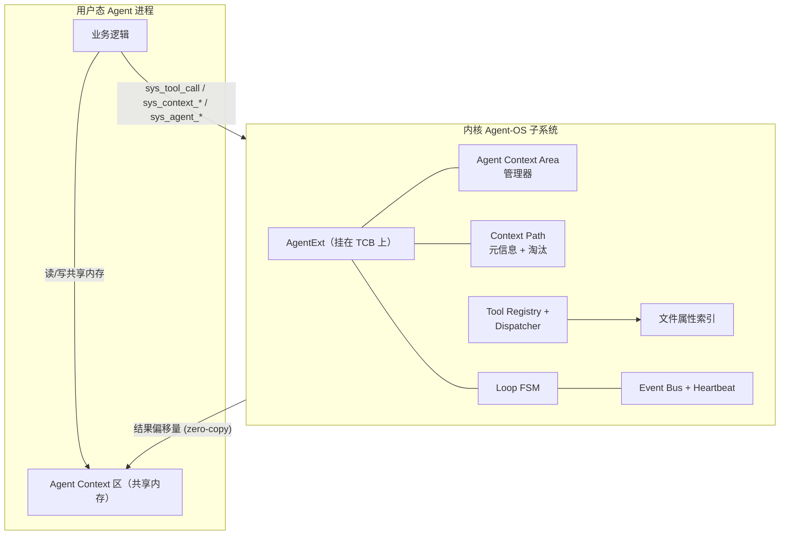

# Agent-OS 总体设计文档

> 在 rCore-Tutorial-v3（ch6 文件系统版）的基础上，扩展面向 AI 智能体（Agent）的内核子系统。

## 1. 设计目标

把"AI 智能体"提升为操作系统的一等公民。具体而言：

1. **进程模型扩展**：在传统进程的"代码段+数据段+堆+栈"之外，新增 **Agent Context 区**——位于用户空间、由内核管理、用于存放高频访问的策略性数据（上下文路径、工具调用历史、查询结果缓存）。
2. **结构化交互接口**：在传统 `syscall(原始参数)` 之上，增加 `tool_call(结构化请求) -> 结构化响应` 这一新型内核交互范式。
3. **上下文路径管理**：内核维护 Agent Loop 的查询路径元信息（长度、配额、淘汰策略），具体内容存在用户态共享内存，实现**零拷贝访问**。
4. **语义化文件访问**：扩展 easy-fs，让文件可按属性/标签/内容摘要被检索，而不仅是路径。
5. **Loop 运行时支持**：内核原生支持心跳触发、事件驱动唤醒、Agent Loop 状态机。

## 2. 设计原则

- **机制与策略分离**（贯穿全程）
  - 内核管"机制"：调度、配额、安全边界、淘汰策略的实现
  - 用户态管"策略"：缓存什么、淘汰哪个、如何组织数据
- **零拷贝优先**：能放共享内存的数据不走 syscall
- **零侵入**：所有 Agent 新代码集中在 `os/src/agent/` 与 `os/src/fs/attr.rs`，原内核代码改动最小化
- **强类型协议**：用 Rust 类型系统约束 Tool 调用，编译期捕获大量错误
- **可演进**：协议带版本号，新工具可热插拔注册

## 3. 模块总览



## 4. Agent 进程地址空间布局

| 虚拟地址范围 | 用途 | 说明 |
|---|---|---|
| `0x0000_1000` 起 | ELF 代码/数据段 | rCore 原有 |
| ↑ 堆区 | 用户堆 | rCore 原有 |
| `0x8000_0000` ~ `0x8001_0000` | **Agent Context 区**（默认 64 KB / 16 页） | **本子系统新增** |
| `... `（高地址）| 用户栈 | rCore 原有，栈底在 ELF 段之后 |
| `0xFFFF_FFFF_FFFF_E000` | TrapContext | rCore 原有 |
| `0xFFFF_FFFF_FFFF_F000` | Trampoline | rCore 原有 |

Agent Context 区被进一步切分为：

```
偏移 0x0000  ┌───────────────────────────┐
            │ Header                    │  共 256 B：版本号、各区段偏移、长度
0x0100      ├───────────────────────────┤
            │ Tool Result Ring          │  ~16 KB：sys_tool_call 写入的结果数据
0x4100      ├───────────────────────────┤
            │ Context Path Buffer       │  ~32 KB：Context Path 节点（环形）
0xC100      ├───────────────────────────┤
            │ Tool Call History         │  ~8 KB：调用统计/Trace
0xE100      ├───────────────────────────┤
            │ Reserved                  │
            └───────────────────────────┘
```

具体偏移参见 `os/src/agent/context_area.rs::Layout`。

## 5. 与 rCore 既有结构的集成

| 既有结构 | 改动 |
|---|---|
| `task::TaskControlBlockInner` | 新增 `agent_ext: Option<Box<AgentExt>>`（普通进程为 `None`，零开销） |
| `mm::MemorySet` | 新增 `map_agent_context(&mut self, size: usize)` 方法 |
| `syscall::syscall()` | 新增 syscall 号 500~534 的分发 |
| `fs::inode::OSInode` | 新增 `attrs: BTreeMap<String, Vec<u8>>` 字段 |
| `task::manager` | 增加 Agent 专用就绪队列（任务五用） |

## 6. Syscall 总表（含编号）

详见 [`./02-syscall-spec.md`](./02-syscall-spec.md)。

## 7. 评分对照

| 评分项 | 本设计的应对 |
|---|---|
| 创新性（30%） | 零拷贝 Context 区、强类型协议、Loop FSM 下沉内核、属性索引 |
| 完整性（20%） | 6 个任务全部实现 |
| 代码质量（25%） | 全部新代码内聚在 `agent/`，强类型错误，单元测试覆盖 |
| 文档完整性（25%） | 本设计文档 + ADR + 性能报告 + README |
