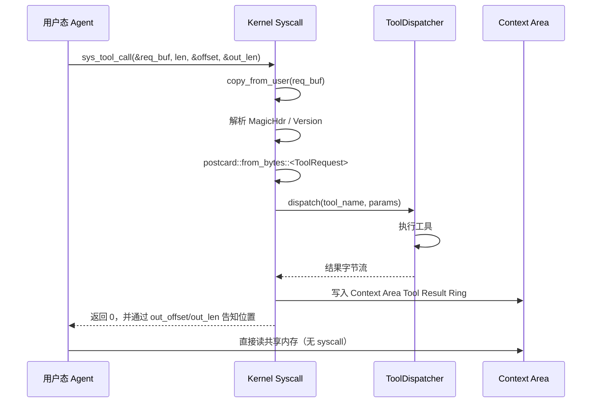

# Syscall 规格

## 编号分配

为避免与 rCore 既有 syscall（0~260）冲突，Agent-OS 子系统统一使用 **500+**。

| 编号 | 名称 | 任务 | 用户态签名 |
|---|---|---|---|
| 500 | `sys_agent_create` | 1 | `fn(cfg: *const AgentCreateCfg) -> isize`  返回子进程 pid |
| 501 | `sys_agent_info`   | 1 | `fn(pid: usize, info: *mut AgentInfo) -> isize` |
| 510 | `sys_tool_call`    | 2 | `fn(req: *const u8, req_len: usize, out_offset: *mut u32, out_len: *mut u32) -> isize` |
| 511 | `sys_tool_list`    | 2 | `fn(buf: *mut u8, buf_len: usize) -> isize` 返回填充字节数 |
| 520 | `sys_context_push` | 3 | `fn(req_summary: *const u8, req_len: usize, resp_summary: *const u8, resp_len: usize) -> isize` 返回新节点索引 |
| 521 | `sys_context_query`| 3 | `fn(start: usize, count: usize, out_offset: *mut u32, out_len: *mut u32) -> isize` |
| 522 | `sys_context_rollback` | 3 | `fn(node_idx: usize) -> isize` |
| 523 | `sys_context_clear`| 3 | `fn() -> isize` |
| 530 | `sys_agent_heartbeat_set`  | 5 | `fn(interval_ms: usize) -> isize` |
| 531 | `sys_agent_heartbeat_stop` | 5 | `fn() -> isize` |
| 532 | `sys_agent_watch`  | 5 | `fn(event_mask: u32, filter: *const u8, filter_len: usize) -> isize` 返回 watch_id |
| 533 | `sys_agent_wait`   | 5 | `fn(timeout_ms: i64) -> isize` 返回触发原因码 |
| 534 | `sys_agent_unwatch`| 5 | `fn(watch_id: usize) -> isize` |
| 535 | `sys_mailbox_recv` | 5 | `fn(buf: *mut u8, buf_len: usize) -> isize` 返回写入字节数 |
| 536 | `sys_agent_set_loop_state` | 1+5 | `fn(state: u32) -> isize`  显式声明 Loop 状态 |
| 537 | `sys_file_attr_del` | 4 | `fn(name: *const u8, name_len: usize, tag: *const u8, tag_len: usize) -> isize` `tag_len==0` 删整个文件属性；返回 1=删掉/0=不存在 |
| 538 | `sys_file_attr_set` | 4 | `fn(name: *const u8, name_len: usize, tag: *const u8, tag_len: usize) -> isize` 给文件设置一个标签 |
| 539 | `sys_agent_set_priority` | 5 | `fn(priority: usize) -> isize` 设置当前任务调度优先级（钳到 255），返回设置后的值 |
| 540 | `sys_file_attr_bench` | 4 | `fn(n: usize, iters: usize, use_index: usize) -> isize` 内核内性能基准：在独立局部属性表上构造 `n` 个文件，把同一组合查询重复 `iters` 次，`use_index!=0` 走倒排索引、否则走全量扫描，返回总耗时（纳秒）。计时排除 syscall/序列化开销，用于"索引 vs 遍历"的对比验收 |

`sys_agent_info` 返回的 `AgentInfo` 布局（16 字节小端）：

```
offset 0:  u32 agent_type        (1=Normal, 2=System)
offset 4:  u32 context_area_size (字节)
offset 8:  u32 path_node_count
offset 12: u32 loop_state        (0=Idle, 1=Thinking, 2=Calling, 3=Observing, 4=Done)
```

`sys_tool_call` 与 `sys_agent_wait` 内部会自动推动 `loop_state`：

```
Idle ──tool_call──► Calling ──完成──► Observing ──agent_wait──► Thinking
                                                  ▲                │
                                                  └─ wait 返回 ────┘
                                                       Idle ◄──┘
```
Agent 可调 `sys_agent_set_loop_state(4)` 显式切到 `Done` 声明任务完成。

## 错误码（统一）

| 值 | 含义 |
|---|---|
| 0+ | 成功 |
| -1 | 用户指针非法 / `copy_from_user` 失败 |
| -2 | 缓冲区不足 |
| -3 | 协议帧损坏 |
| -4 | 进程非 Agent（未先 `sys_agent_create`） |
| -5 | 配额耗尽 |
| -6 | 目标不存在（pid、context 节点） |
| -7 | 权限不足 |

## 关键调用流程

### sys_tool_call



### sys_context_push

- 用户态先把 `(req_summary, resp_summary)` 准备好
- 内核检查 PCB 中的配额，必要时按 LRU/FIFO 淘汰最早节点
- 内核把节点数据**写入 Context Area Path Buffer**（环形），更新 PCB 中的 head/tail/len
- 用户态后续读路径**无 syscall**（直接读 Path Buffer + 看 header.version 防撕裂）

## 内存可见性约定

| 共享内存区域 | 内核可读 | 内核可写 | 用户可读 | 用户可写 |
|---|---|---|---|---|
| Header | ✅ | ✅ | ✅ | ❌（只读视图） |
| Tool Result Ring | ✅ | ✅ | ✅ | ❌ |
| Path Buffer | ✅ | ✅ | ✅ | ❌ |
| Tool Call History | ✅ | ✅ | ✅ | ✅（用户可写自己的统计） |

为防止用户篡改内核维护的元数据，内核会在 page table 中把前 3 个区域映射为 `R | U`，最后一个映射为 `R | W | U`。
